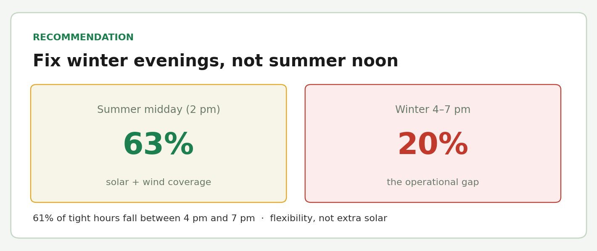
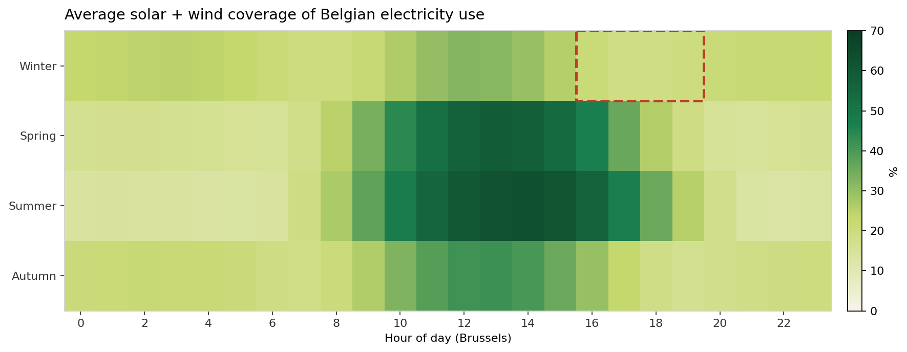

# Renewable generation and electricity load in Belgium (Wallonia zoom)

| | |
|---|---|
| **Stack** |      |
| **Level** | Intermediate *(proposed — to confirm)* |
| **Data specialty** | BI / Data engineering |

## Objective

Belgium is adding solar and wind, but output follows the weather. A grid
operator or supplier needs a simple answer: **when do those sources cover
national electricity use, and what should we do about the hours that stay
uncovered?**

This project builds a reproducible pipeline (Elia and Copernicus APIs →
DuckDB → SQL) and a Streamlit dashboard with a **numbered recommendation**
for an energy-sector decision maker.

Elia publishes electricity use for **Belgium as a whole**, not per region.
Coverage (generation / use) is therefore national. Wallonia is the
production and weather zoom — not a regional coverage ratio.

## Result and recommendation

Over Sep 2023 – Aug 2026, solar + wind cover **27%** of Belgian electricity
use on average (median 24%). A summer 2 pm hour reaches **~63%**. The winter
4–7 pm slot stays around **20%**.

Summer demand peaks around noon, and solar already follows them (about
3× more PV at the busiest 10% of summer hours). Tight hours — high demand
**and** low renewables — are rare (0.7% of quarter-hours) but severe
(~1% coverage). **61% of them fall between 4 pm and 7 pm.**

**Recommendation:** put flexibility (demand shifting, storage, imports) on
the **winter 4–7 pm** slot, rather than extra solar for summer peaks.





Full write-up (French): [`docs/recommandation.md`](docs/recommandation.md).
Method and four questions: [`docs/analyse.md`](docs/analyse.md).
Dashboard: `python -m renewables_wallonia.cli dashboard`.

## Four questions (one chart each in the dashboard)

1. **Coverage.** How does Belgian solar + wind coverage of electricity use
   vary by hour and season?
2. **Summer peaks.** Does solar coincide with summer demand peaks?
3. **Walloon weather.** Which weather factors best explain Walloon solar
   and wind output?
4. **Complementarity.** Do solar and wind cover for each other, and where
   are the troughs?

Walloon PV tracks ERA5 radiation closely (r ≈ 0.92); Walloon wind tracks
10 m wind speed (r ≈ 0.88). Solar and wind together are only weakly
complementary (r ≈ −0.21).

## Data

- **Elia Open Data** (no API key): historical 15-minute series — total
  load (`ods001`), solar (`ods032`), wind (`ods031`). Period: Sep 2023 –
  Aug 2026 (36 months, editable in `config/settings.toml`).
- **Copernicus ERA5** (CDS account + `~/.cdsapirc`): solar radiation and
  10 m wind, spatially averaged over Belgium / Wallonia — no GIS.

## Method (short)

Star schema in DuckDB (`sql/schema.sql`, view `v_belgium_qh`). Named SQL
in `sql/analysis/`. Summer peak = P90 of summer load; stress = P90 load
**and** P10 renewable — conventions, not Elia grid thresholds. Daytime
solar–weather correlation uses hours with radiation above 10 W/m² so
nights at zero do not inflate r.

## Limits

- National load only: this is not “Wallonia covers its own demand”.
- Elia generation is *measured & upscaled*, not validated metering.
- ERA5 is reanalysis (series end ~19 Aug 2026); wind is at 10 m, not hub
  height.
- Peak and stress quantiles are analysis choices in
  `config/settings.toml`.

## Reproduce

```bash
pip install -e ".[dev]"
python -m renewables_wallonia.cli --help
python -m renewables_wallonia.cli show-config
python -m renewables_wallonia.cli ingest-elia
python -m renewables_wallonia.cli ingest-copernicus
python -m renewables_wallonia.cli build-warehouse
python -m renewables_wallonia.cli analyze
python -m renewables_wallonia.cli dashboard
pytest
```

`ingest-elia` and `ingest-copernicus` write into `data/` (gitignored).
Re-run with `--force` to replace files. Copernicus needs a CDS token in
`%USERPROFILE%\.cdsapirc` and can sit in a queue for several minutes per
month.

## Repo structure

```
config/settings.toml     # period, Elia datasets, ERA5 bbox — nothing hardcoded
data/raw/                # untouched API extracts (gitignored)
data/processed/          # era5_hourly.csv, warehouse.duckdb, analysis/ (gitignored)
sql/schema.sql           # DuckDB star schema + v_belgium_qh
sql/analysis/            # named SQL for the four business questions
src/renewables_wallonia/ # package (CLI + config + analysis + dashboard)
webapp/app.py            # Streamlit dashboard
docs/recommandation.md   # numbered recommendation (French)
docs/analyse.md          # four questions, method, limits (French)
pictures/readme/         # README figures
tests/
```

See `ROADMAP.md` and `JOURNAL.md` (French, like the rest of the codebase).

## Presentations

HTML slides (GitHub Pages, generated from Marp sources in
`docs/presentations/`):

- [Recruiter overview (EN)](docs/slides/presentation-recruteur-en.html)
- [Technical deep dive (EN)](docs/slides/presentation-technique-en.html)
- [Présentation grand public (FR)](docs/slides/presentation-recruteur-fr.html)
- [Présentation technique (FR)](docs/slides/presentation-technique-fr.html)
