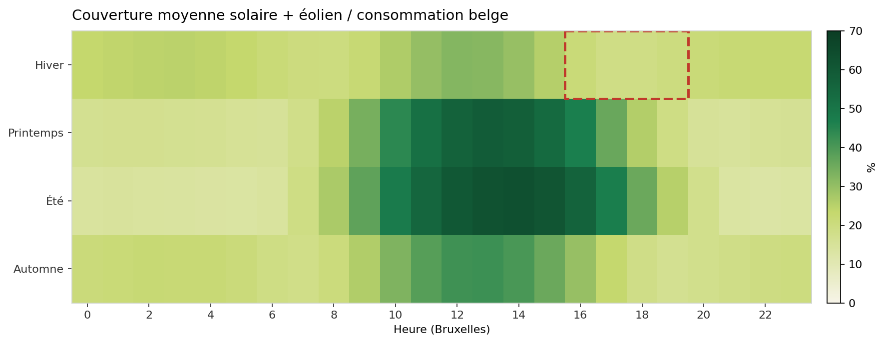
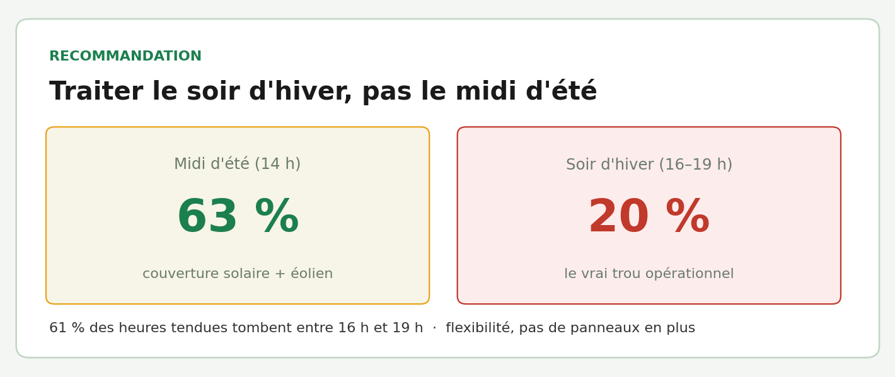

# Électricité renouvelable en Belgique
## Zoom production Wallonie

*Pipeline API → analyse → dashboard, avec une reco chiffrée*

---

## Le problème

Le solaire et le vent ne produisent pas de façon régulière : tout dépend du ciel et du vent.

Un gestionnaire de réseau ou un fournisseur a besoin de savoir **quand** cette production couvre la consommation belge — et **où placer le prochain effort**, plutôt que d'ajouter du solaire au hasard.

---

## Les données

Les chiffres officiels du réseau belge (Elia), au quart d'heure, plus la météo Copernicus. Pas de carte : on compare des courbes dans le temps.

La consommation n'est publiée que pour **toute la Belgique**. La Wallonie est le zoom sur la production, pas un taux de couverture régional.

---

## Le résultat (3 ans)

Solaire + éolien couvrent en moyenne **27 %** de la consommation belge.

Le midi d'été est déjà bien couvert. Le trou, c'est le **début de soirée en hiver**.

---

## Recommandation

Mettre la flexibilité (déplacer la demande, stocker, importer) sur le créneau **16 h–19 h en hiver**, pas un surplus de panneaux pour les pics d'été.

Dashboard : `python -m renewables_wallonia.cli dashboard`
